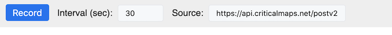
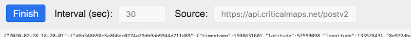
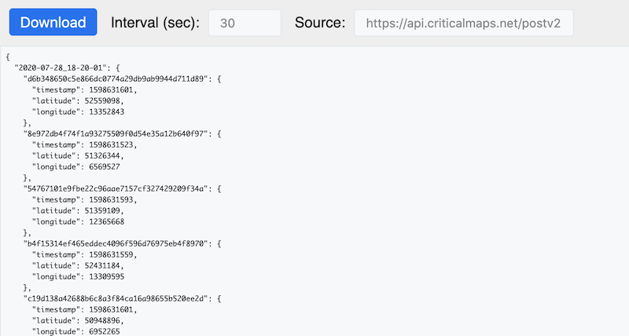

# CriticalSnake Recorder

Record Critical Mass data from [criticalmaps.net/map](https://www.criticalmaps.net/map) that can be used to generate interactive replays.

## Graphial User-Interface

The graphical UI provides a minimal toolset for recordings with a focus on simplicty and reliability. If you want to use advanced features, please have a look at the [Interactive Console](#interactive-console).

On the [record page](https://weliveindetail.github.io/CriticalSnake/record.html) you can make a recording for the period of time that you want to capture in three steps:



Click on `Record` to start capturing snapshots of the Critical Mass data in your browser. A new line of data should appear every 30 seconds (depending on your interval setting). Intervals of 30 to 60 seconds worked well for me so far. While recording, make sure the page stays open and your computer is not going to sleep. Connect it to the power plug and tell your OS.



Once you captured all the relevant snapshots, click on `Finish`. The collected data lines will be converted into the JSON format like below.



Now click on `Download` to save the data as a compressed file on disk. In this example, I named the file `2020-08-28.recording` and [committed it to the repository](https://github.com/weliveindetail/CriticalSnake/blob/f9f4878a25733fcef645d7d3ca8105b44262f84d/replay/2020-08-28/2020-08-28.recording) afterwards.

## Interactive Console

The interactive console provides full access and additional control over the recording process.

### Example: Store intermediate backups of your recording

Recording data is a long-running process and you won't monitor it yourself all the way through. (Most likely because you want to go and ride with the Critical Mass yourself.) But things can go wrong and there's always a risk to lose your recorded data. So let's see how to make a backup without interrupting the recording process.

Start a recording and type `recording` in the interactive console. You should get a hash-map of all the snapshots collected so far:
```
> recording
{2020-09-29_16-16-45: {…}, …}
```

As a recording can grow pretty large in size, there's a simple way to compress it:
```
> compressRecording()
Raw size is: 10 KB
Compressed size is: 1 KB
```

Let's trigger a download for the data (it will choose `.json` for uncompressed and `.recording` for compressed data):
```
> download(recording)
Starting download for 2020-09-29_16-31-32.json
```

If you run this page on localhost or from your filesystem, your browser might download the file right away without asking for permission. (You may have tell your browser that the page is allowed to download multiple files.) In this case, it's quite easy to automate the process. Let's schedule a backup of our recording state every 30 minutes:
```
> backupTimer = setInterval(() => download(recording), 30 * 60 * 1000)
```

You can cancel it anytime with:
```
> clearInterval(backupTimer)
```
